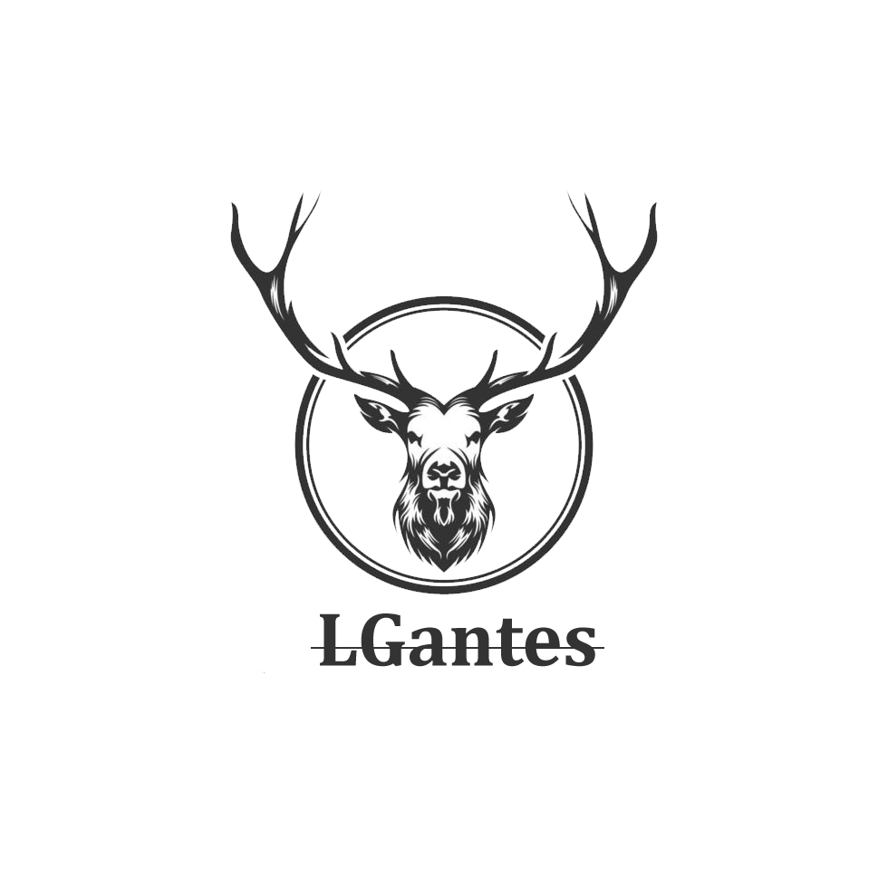

# Excelente al visitar este tu espacio 🐿   

 

# :bust_in_silhouette: Información # 
                                           
*Nombre del alumno:* Gantes Rivero Maria Guadalupe.

*Numero de control:* 17210562.

---------------------------------------------------------
| **Lunes** | **Martes** | **Miercoles** | **Jueves** |
|:----------:|-----------|:-------------:|:----------:|
|    LCLB    |    LCLB   |      9301     |    91L4    |
|    15/16   |   15/16   |     15/16     |    15/16   |
  
  

*Nombre del maestro:* RENE SOLIS REYES.

*Materia:* Sistemas Programables.

Herramientas para clases 
- Arduino clasico
- STM32
- RaspberryPi 
- kit de sensores y herramientas soldar

                       
